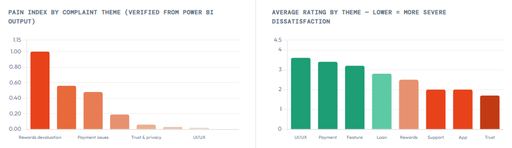
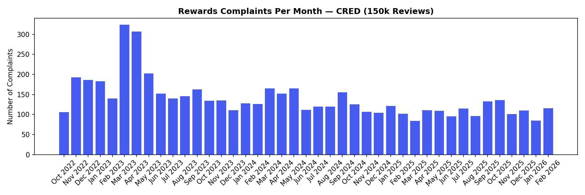

# CRED App — 150K+ Play Store Review Analysis

## Problem Statement

CRED has a strong Play Store rating on the surface, but the actual user experience can feel very different once users engage with rewards and redemption. This project was built to test whether that mismatch appears clearly in review data.

The answer was yes.

***

## Core Finding

While the app's overall rating stands at **4.20**, reviews related to rewards average only **2.48 stars**. That creates a **1.72-star gap** between the headline number and the experience of users discussing one of the app's most visible value propositions.

The issue is not isolated to one release. Complaint themes remained spread across app versions over time, suggesting a structural product problem rather than a one-off bug.


***

## Dataset

| Field | Value |
|---|---|
| Source | Google Play Store (India) |
| App | CRED — com.dreamplug.androidapp |
| Reviews scraped | 150,000 |
| Date range | Oct 2022 – Feb 2026 |
| App versions covered | 233 |
| Versions retained for version analysis | 110 |
| Final cleaned reviews analysed | 134,552 |

***

## What This Project Does

### 1. Classifies complaint themes
Defined 8 themes from review text using keyword-driven logic:
- rewards_devaluation
- customer_support
- payment_issues
- app_performance
- ui_ux
- loan_issues
- trust_privacy
- feature_request

### 2. Tests whether complaints are version-specific or structural
For each theme, checked how much complaint concentration sits in the top complained-about versions. The concentration stayed low, which indicates a broad and recurring product issue rather than a release-specific spike.

### 3. Builds a weighted Pain Index
Created a prioritisation score using two signals:
- **40% complaint volume**
- **60% community validation (thumbs up)**

Both inputs were normalised first, then combined so that highly upvoted complaint themes rank above issues that are merely frequent.

***

## Pain Index Results

| Theme | Pain Index |
|---|---|
| rewards_devaluation | 1.000 |
| customer_support | 0.556 |
| payment_issues | 0.477 |
| app_performance | 0.194 |
| trust_privacy | 0.057 |
| feature_request | 0.025 |
| ui_ux | 0.021 |
| loan_issues | 0.000 |

Rewards devaluation clearly emerges as the top issue by impact, not just by raw volume.


***

## Key Numbers

| Metric | Value |
|---|---|
| Overall app rating | 4.20 ★ |
| Rewards-related average rating | 2.48 ★ |
| Rating gap | 1.72 stars |
| Rewards reviews that are 1–2 star | 59.8% |
| Cashback mentions | 3,215 |
| Total thumbs up on rewards complaints | 42,226 |
| Most upvoted single complaint | 2,603 thumbs up |

***

## Why It Matters

This project shows how an app can appear healthy at the aggregate level while hiding concentrated dissatisfaction in a key value area. It also shows why product teams should go beyond average rating and look at complaint segmentation, version spread, and user-validated pain points.

In this case, the implication is clear: the rewards experience needs strategic redesign, not a minor release patch.

***

## Repo Contents

```text
Analysis.ipynb
cred_powerbi.csv
cred_dashbaord.pbix
cred_dashboard.pdf
rewards_trend.png
README.md
```

***

## Tools Used

- Python
- pandas
- google-play-scraper
- matplotlib
- Power BI

***

## Medium Write-up

[Read the full article](https://medium.com/@arjunreddy.inc/i-analysed-1-50-000-cred-reviews-because-i-got-curious-about-my-own-coins-which-i-got-as-rewards-8ab54d11e6ac)

***

Independent project built to demonstrate product thinking, user pain-point analysis, and data storytelling for Data Analyst, Business Analyst, and Product Analyst roles.
